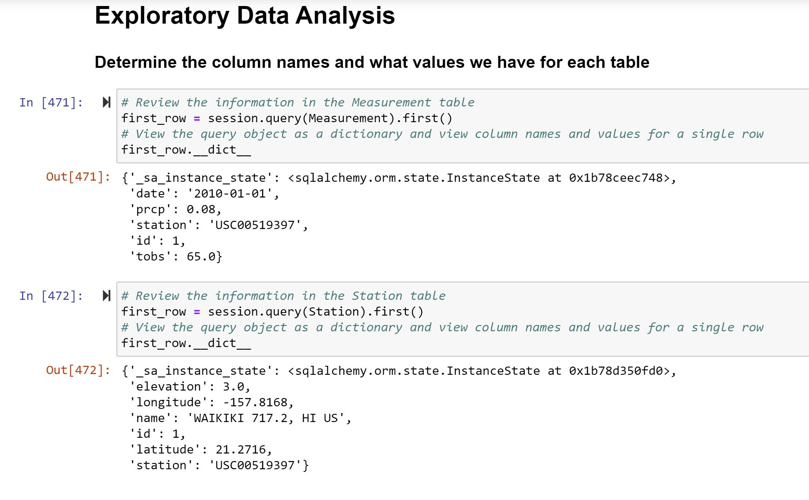
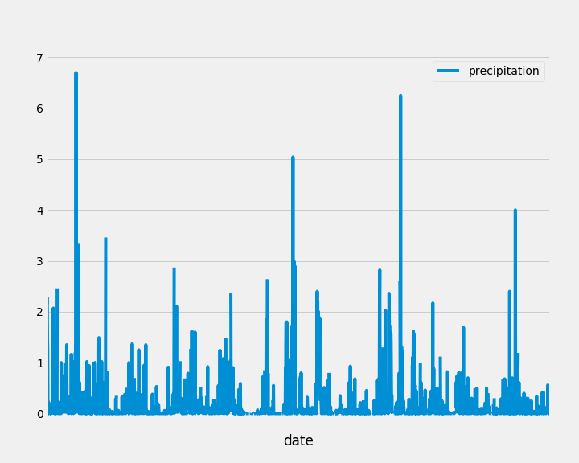
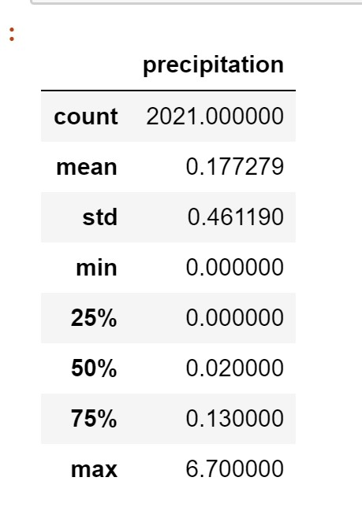
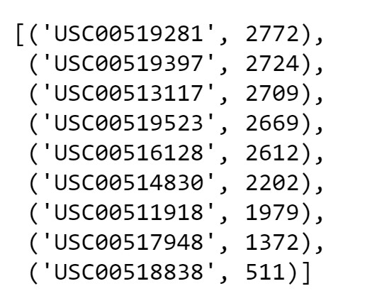
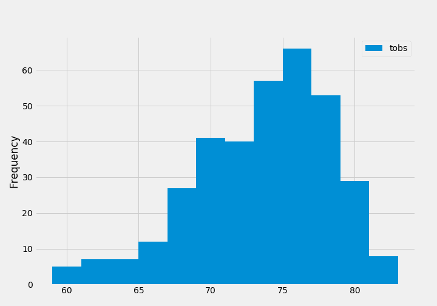
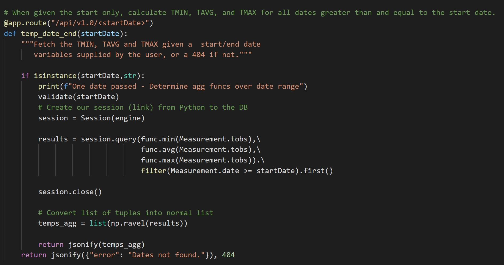
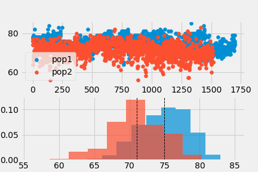
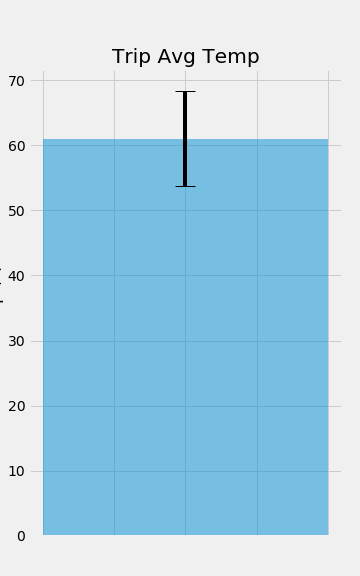
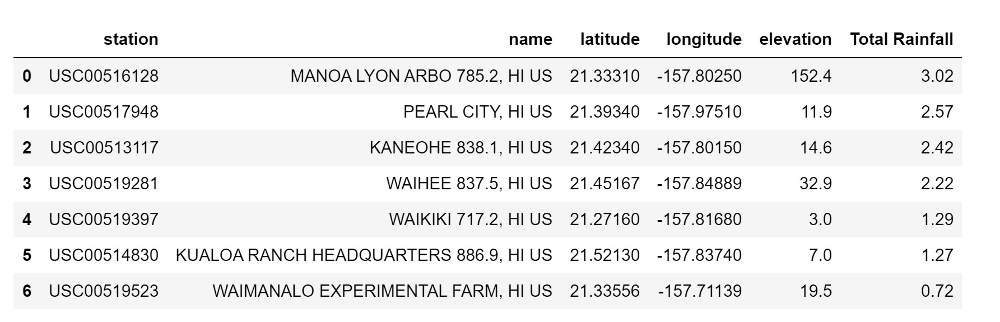
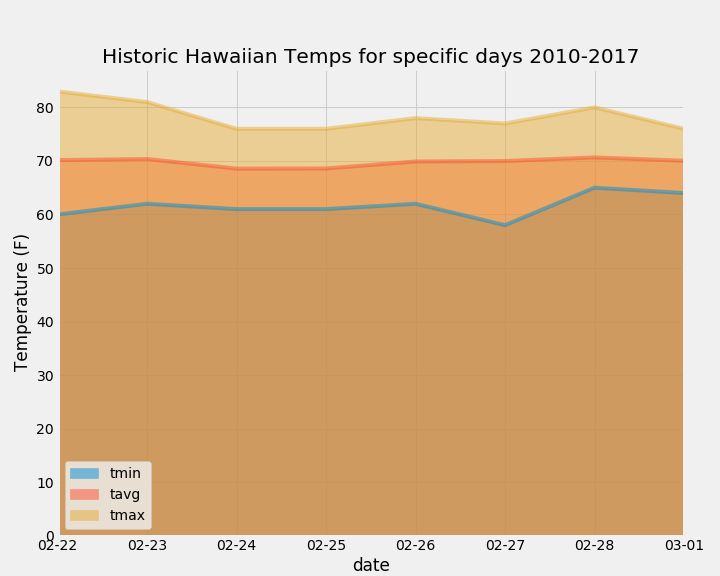

# SQLAlchemy Hawaiian weather analysis - Surfs Up!

I've decided to treat myself to a long holiday vacation in Honolulu, Hawaii! To help with my trip planning, I did some climate analysis on the area. Using using SQLAlchemy ORM queries, Pandas, and Matplotlib on a SQLite database with two tables containing meterological data several aspects of weather were studied.  

## Climate Analysis and Exploration

To begin, Python and SQLAlchemy was used to review the two tables in the Sqlite database [hawaii.sqlite](Resources/hawaii.sqlite) provided.

* A start date and end date for my trip was chosen as Feb 22 - Mar 1. 

## Precipitation Analysis

* A query to retrieve the last 12 months of precipitation data was used to return `date` and `prcp` values.

* Plot the results using the DataFrame `plot` method.

  

* Pandas to print the summary statistics for the precipitation data.

### From the summary stats on precipitation we see that Hawaii didn't get a lot of rain the previous year

# Station Analysis

* The database was queired to determine the total number of stations: 9

* The most active station was determined to be 'USC00519281'

  * The list of stations and observation counts in descending order was:
  
      

* The most active statioin logged the following number of temperature observations over the last 12 months of temperature observation data (tobs) in the database.

    
    
* For the most active station over the period from 2010-2017 the following was determined:
  * The lowest temperature recorded was: 54 F
  * The highest temperature recorded was: 85 F
  * The average temperature recorded was: 71.7 F
- - -

##  Climate App

After completing my initial analysis, I designed a Flask API based on the queries that I have just developed.

### Routes

* `/`

  * Home page.

  * Listed all routes that are available.

* `/api/v1.0/precipitation`

  * Convert the query results to a Dictionary using `date` as the key and `prcp` as the value.

  * Return the JSON representation of your dictionary.

* `/api/v1.0/stations`

  * Return a JSON list of stations from the dataset.

* `/api/v1.0/tobs`
  * query for the dates and temperature observations from a year from the last data point.
  * Return a JSON list of Temperature Observations (tobs) for the previous year.

* `/api/v1.0/<start>` and `/api/v1.0/<start>/<end>`

  * Return a JSON list of the minimum temperature, the average temperature, and the max temperature for a given start or start-end range.

  * When given the start only, calculate `TMIN`, `TAVG`, and `TMAX` for all dates greater than and equal to the start date.

  * When given the start and the end date, calculate the `TMIN`, `TAVG`, and `TMAX` for dates between the start and end date inclusive.

Example code for the API app is below:

# Temperature Analysis I

* Hawaii is reputed to enjoy mild weather all year. Is there a meaningful difference between the temperature in, for example, June and December?

* The the average temperature in June at all stations across all available years in the dataset was: `74.94 F`. 
* The the average temperature in December at all stations across all available years in the dataset was: `71.04 F`.
* Using a paired t-test, it was determined the difference in the means was statistically significant. 

### `Ttest_indResult(statistic=31.355036920962423, pvalue=4.193529835915755e-187)`

# Temperature Analysis II

* A function called `calc_temps` that will accept a start date and end date in the format `%Y-%m-%d` and return the minimum, average, and maximum temperatures for that range of dates was used to calculate the min, avg, and max temperatures for my trip using the matching dates from the previous year:

  * The lowest temperature recorded was: 61 F
  * The highest temperature recorded was: 77 F
  * The average temperature recorded was: 69.7 F
This is slightly cooler than the results for all the dates observed above (54,85,71.7).

* The min, avg, and max temperature from your previous query was plotted as a bar chart.

    

# Daily Rainfall Average

* Calculated the rainfall per weather station using the previous year's matching dates.

# Daily Normals - averages for the min, avg, and max temperatures

* Using a function called `daily_normals` that will calculate the daily normals for a list of specific dates, the normals were determined across all years for the dates I plan to do my vacation (Feb 22 - Mar 1).

* This data was plotted in an area plot

  

